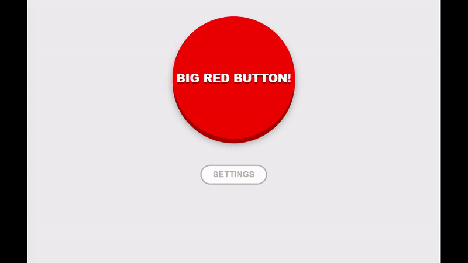

# Dummy-buttons

Dummy-buttons is a simple project where implemented some solutions of buttons 
that usually used in real projects. This is my first experience working with 
React, so please do not don't judge too harshly. 



## Built With

  * React 18.0.0
  * Styled Components 5.1.25

## Quick Start

  1. Install dependencies
  ```sh
  yarn add yarn
  ```
  2. run the app
  ```sh
  yarn start
  ```

## Functionality 

* Main button (no functionality / calls modal dialog)
* Settings toggle button (open settings menu)
* Dark mode toggle (change the app theme)
* Disable button toggle (disables main button)
* Dialog button (set main button action to call dialog)